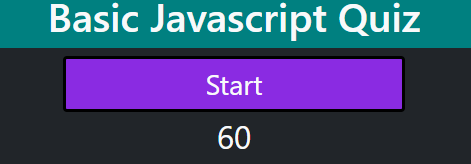
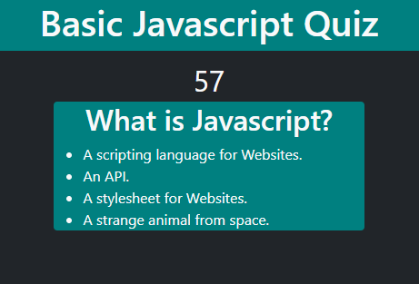

# codequizproject

A short 3 questions quiz on Javascript to test bits of knowledge.

## Usage

Click the START button on the webpage

The timer will start counting down from 60, click on the answer you want to choose your answer. 
If you answer incorrectly, 15 seconds will be taken from the clock

When you finish, your score will be displayed(unfinished!)

